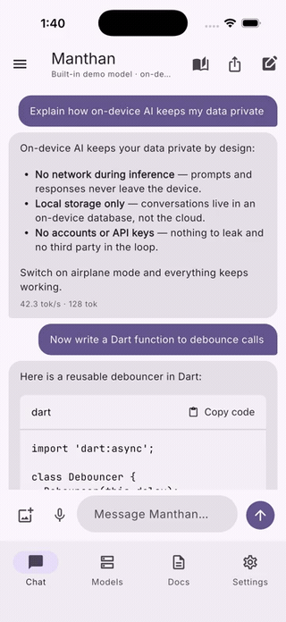
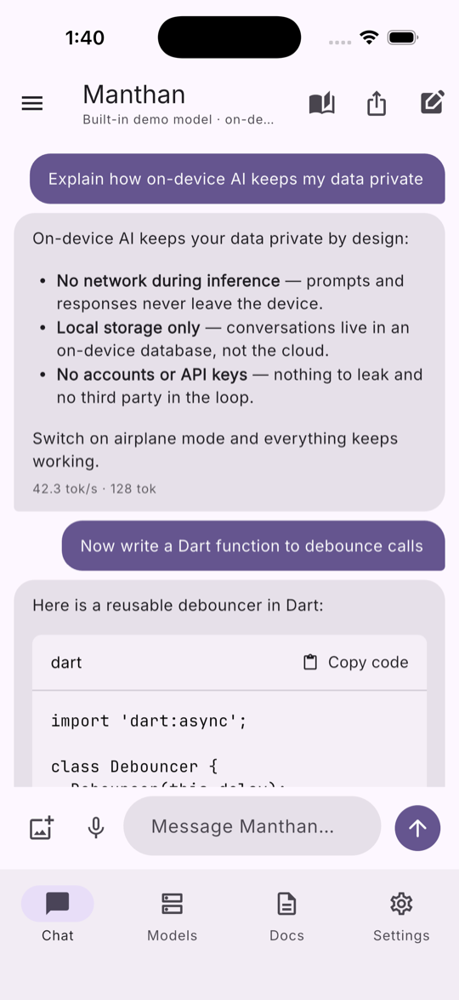
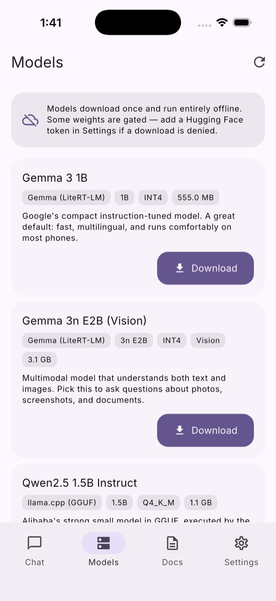
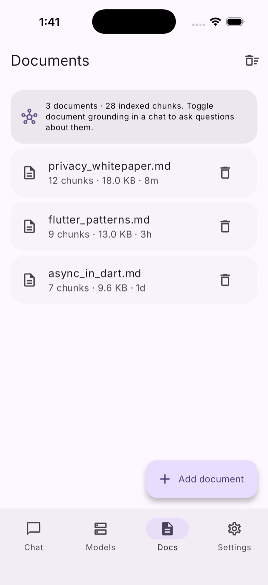
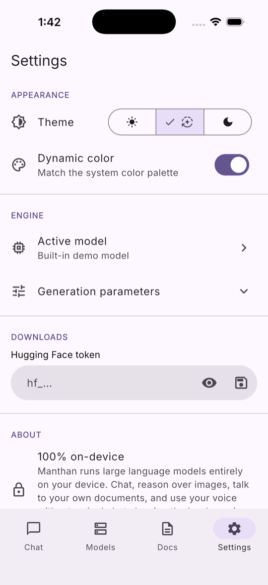
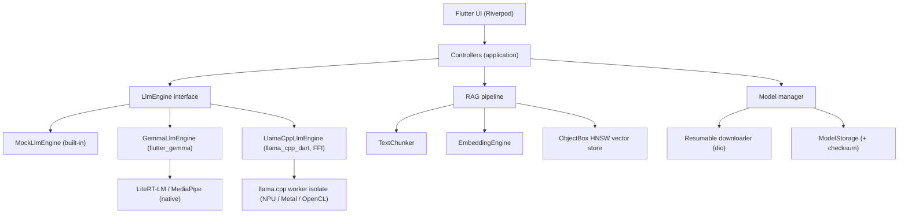

<div align="center">

# 🌀 Manthan

<sup>**Manthan** (Sanskrit: मंथन, _"churning"_) — from _Samudra Manthan_, the churning of the ocean to extract _amrita_, the nectar of wisdom.</sup>

### Private, on-device AI assistant — no cloud, no leaks.

Chat with local LLMs, reason over images, talk to your own documents, and dictate
with your voice. **100% on-device.** Switch on airplane mode and everything still works.

[](https://github.com/Ayushd70/manthan/actions/workflows/ci.yaml)
[](https://flutter.dev)
[](#-platforms)
[](#-why-manthan)
[](LICENSE)
[](https://pub.dev/packages/very_good_analysis)

<br />



</div>

---

## Table of contents

- [Why Manthan](#-why-manthan)
- [Features](#-features)
- [Screenshots](#-screenshots)
- [Architecture](#-architecture)
- [Getting started](#-getting-started)
- [Running real models](#-running-real-models)
- [How it works](#-how-it-works)
- [Platforms](#-platforms)
- [Tech stack](#-tech-stack)
- [Roadmap](#-roadmap)
- [Contributing](#-contributing)
- [License & acknowledgements](#-license--acknowledgements)

## ✨ Why Manthan

> **The name** — _Manthan_ (मंथन) means **"churning"** in Sanskrit. It evokes
> _Samudra Manthan_, the mythological churning of the cosmic ocean to draw out
> _amrita_ (the nectar of immortality). That's the idea here: churn through your
> thoughts, notes, and questions to extract clarity — entirely on your own device.

Most “AI” apps are thin clients that stream your data to someone else’s servers.
**Manthan is the opposite** — a privacy-first assistant where _every token is
generated on the device in your hand_.

- 🔒 **No network during inference.** No API keys, no accounts, no telemetry.
- 🧩 **Two real engines, one interface.** Google LiteRT-LM/MediaPipe **and**
  `llama.cpp` (GGUF) behind a single `LlmEngine` abstraction.
- 🚀 **Works on first launch.** A built-in demo engine means you can explore the
  whole app before downloading a single model.
- 🖼️ **Multimodal.** Ask questions about images with vision-capable models.
- 📚 **Chat with your documents.** On-device retrieval-augmented generation (RAG)
  with an ObjectBox **HNSW** vector index.
- 🎙️ **Voice in.** Dictate prompts with on-device speech-to-text.

## 🧠 Features

| Area                     | What you get                                                                                                           |
| ------------------------ | ---------------------------------------------------------------------------------------------------------------------- |
| **Local chat**           | Streaming Markdown with syntax-highlighted code, live **tokens/sec + RAM HUD**, stop/continue                          |
| **Pluggable engines**    | `flutter_gemma` (LiteRT-LM/MediaPipe) and `llama_cpp_dart` (GGUF over `dart:ffi`, worker isolate) behind one interface |
| **Built-in demo engine** | Zero-download engine that powers first-run, tests, and CI                                                              |
| **Model manager**        | Resumable downloads with progress, checksum verification, storage usage, one-tap activate/delete                       |
| **Multimodal**           | Attach images and ask questions about them (vision models)                                                             |
| **On-device RAG**        | Import notes/text → chunk → embed → ObjectBox HNSW search → grounded answers **with citations**                        |
| **Voice input**          | On-device speech-to-text dictation                                                                                     |
| **Voice output**         | Read answers aloud (per-message or auto-speak after replies)                                                           |
| **Personalization**      | Material 3 + dynamic color, light/dark, adjustable temperature/top-k/top-p/max-tokens/system prompt                    |
| **History**              | Conversations persisted locally; rename, delete, and **share/export** as Markdown                                      |

## 📸 Screenshots

<table>
  <tr>
    <td align="center"><br /><sub><b>Local streaming chat</b><br />markdown · code · tokens/sec</sub></td>
    <td align="center"><br /><sub><b>Model manager</b><br />download · verify · activate</sub></td>
    <td align="center"><br /><sub><b>On-device RAG</b><br />chunk · embed · index</sub></td>
    <td align="center"><br /><sub><b>Settings</b><br />theme · engine · params</sub></td>
  </tr>
</table>

## 🏗️ Architecture

Manthan uses a **feature-first clean architecture**. The defining decision is the
**engine seam**: the UI and controllers depend only on the `LlmEngine` interface,
never on a vendor runtime — so a new backend is a drop-in.



```
lib/
  app/                 Theming, routing, navigation shell
  core/                Utilities, theme, perf HUD, DI providers
  data/local/          ObjectBox entities + store
  features/
    chat/              Conversations, streaming, persistence
    inference/         Engine abstraction + Gemma / llama.cpp / mock adapters
    models/            Catalog, resumable downloads, storage
    rag/               Chunking, embeddings, vector search, retrieval
    voice/             On-device speech-to-text (swappable)
    settings/          Appearance, generation params, tokens
    home/              Adaptive navigation shell
```

Each feature is split into `domain` (pure entities + interfaces), `data`
(implementations), `application` (Riverpod controllers), and `presentation`
(widgets). The `domain` layer never imports Flutter or any vendor package.

## 🚀 Getting started

**Requirements:** Flutter `3.41+`, Dart `3.11+`. For iOS, **iOS 16+**
(required by `flutter_gemma` / MediaPipe).

```bash
git clone https://github.com/Ayushd70/manthan.git
cd manthan
flutter pub get

# Generate ObjectBox bindings
dart run build_runner build --delete-conflicting-outputs

flutter run
```

The app launches straight into a working chat backed by the **built-in demo
engine** — no model download required. To run real models, open the **Models**
tab, download one, then it becomes active automatically.

### Quality gate (what CI runs)

```bash
dart format lib test
flutter analyze
flutter test
```

## 📦 Running real models

| Model                     | Engine           | Size    | Notes                                 |
| ------------------------- | ---------------- | ------- | ------------------------------------- |
| **Gemma 3 1B**            | LiteRT-LM        | ~555 MB | Fast default · gated (needs HF token) |
| **Gemma 3n E2B**          | LiteRT-LM        | ~3.1 GB | 🖼️ Vision support · gated             |
| **Qwen2.5 1.5B Instruct** | llama.cpp (GGUF) | ~1.1 GB | Strong coder · open                   |
| **SmolLM2 360M Instruct** | llama.cpp (GGUF) | ~386 MB | Ultra-light · open                    |

- **Gated Google weights** need a free
  [Hugging Face token](https://huggingface.co/settings/tokens) — add it in
  **Settings → Downloads**. Open GGUF models download without a token.
- **`llama.cpp` on a real device** additionally requires the native `llama`
  library to be bundled (Android AAR / iOS xcframework / desktop dylib) — see the
  [`llama_cpp_dart` setup](https://pub.dev/packages/llama_cpp_dart). The Gemma
  engine and the built-in demo engine work out of the box.

## ⚙️ How it works

1. **Engines** implement a single `LlmEngine` contract: `load`, `generate`
   (a `Stream<GenerationChunk>`), `stop`, `dispose`. `EngineFactory` maps a
   catalog model to the right backend.
2. **Generation** runs off the UI thread (native sessions for Gemma; a dedicated
   isolate for llama.cpp), streaming tokens that the chat controller assembles
   while measuring throughput.
3. **RAG**: documents are chunked with overlap, embedded, and stored in ObjectBox
   with an `@HnswIndex`. At query time the question is embedded and the nearest
   chunks are retrieved and injected into the prompt — answers cite their sources.
4. **Privacy**: the only network access is **downloading model weights**. Toggle
   airplane mode after downloading and the app keeps working end to end.

## 💻 Platforms

| Platform                | Status       | Min version |
| ----------------------- | ------------ | ----------- |
| Android                 | ✅           | API 26+     |
| iOS                     | ✅           | 16.0+       |
| macOS / Windows / Linux | ✅ (desktop) | —           |

Mobile is the primary surface; desktop builds power CI and screenshots.

## 🧰 Tech stack

**Flutter · Dart 3 · Riverpod · go_router · ObjectBox (HNSW vector search) ·
`flutter_gemma` · `llama_cpp_dart` · dio · gpt_markdown · speech_to_text ·
Material 3 dynamic color.** Linted with `very_good_analysis`; CI runs
format + analyze + tests plus Android & desktop builds.

## 🗺️ Roadmap

- [x] Pluggable multi-engine inference (mock · Gemma · llama.cpp)
- [x] Streaming chat with tokens/sec + RAM HUD
- [x] Model manager with resumable downloads & checksums
- [x] Multimodal image input
- [x] On-device RAG with ObjectBox HNSW + citations
- [x] Voice input (speech-to-text)
- [x] Text-to-speech (read answers aloud)
- [ ] PDF / DOCX document import
- [ ] Whisper.cpp STT backend (fully offline transcription)
- [ ] Text-to-speech (read answers aloud)
- [ ] Per-conversation model pinning & presets
- [ ] Function calling / tools
- [ ] Prompt library & saved system prompts
- [ ] Encrypted-at-rest storage for chats & documents

See the detailed [roadmap](docs/ROADMAP.md) and
[open issues](https://github.com/Ayushd70/manthan/issues) for the latest.

## 🤝 Contributing

Contributions are welcome! Please read [CONTRIBUTING.md](CONTRIBUTING.md) for the
project layout, coding standards, and how to add a new engine or model. Use
[Conventional Commits](https://www.conventionalcommits.org/) for commit messages.

## 📄 License & acknowledgements

[MIT](LICENSE) © [Ayush Dubey](https://ayushd70.dev)

Built on the shoulders of excellent open source:
[`flutter_gemma`](https://pub.dev/packages/flutter_gemma),
[`llama_cpp_dart`](https://pub.dev/packages/llama_cpp_dart),
[ObjectBox](https://objectbox.io),
[Riverpod](https://riverpod.dev), and
[gpt_markdown](https://pub.dev/packages/gpt_markdown).

<div align="center">
<sub>Made with Flutter · Runs entirely on your device.</sub>
</div>
